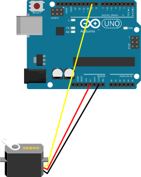

# servo_slack_with_arduino

> Move your Arduino's servo from Slack!

## background

Since it is necessary to freely move the Arduino servo motor with Slash command from Slack, create a command line tool.

## install

### Set your Arduino

Servo power supply is Arduino 5v or separate supply and connect control signal to any digital PIN (code default 9 PIN).



### Install Arduino IDE & write a code on board

1. Download & Install [Arduino IDE](https://www.arduino.cc/en/main/software)
2. Connect your Arduino with USB 2.0.
3. Open [src/arduino/servo.ino](src/arduino/servo.ino) on Arduino IDE and write a code on board.

### Install Python dependencies

```
$ pip install -r requirements.txt
```

## Usage

### CLI
Enjoy running [Python code](src/python/main.py)!

```
Overview:
  Run Arduino Servo from the command line
Usage:
  main.py [-h|--help] [-v|--version]
  main.py move <angle> [--port <port>] [--baudrate <baudrate>]
  main.py wipe <delay> <time> [--port <port>] [--baudrate <baudrate>]

Options:
  move           : move a servo to specific angle
  <angle>        : the angle to movie a servo
  <delay>        : delay time wiping servo
  <time>         : wipe repeat time
  -h, --help     : show this help message and exit
  -v, --version  : show version
  --baudrate     : baudrate with serial comm
  --port         : port with serial comm
```

### Rest API

If use it for rest API, run FastAPI server, and call POST API.

```
make server-run
```

#### Move specific angle

Set the payload include angle.

```
curl --location --request POST 'http://YOUR_SERVER_HOST:8000/move' \
--header 'Content-Type: application/json' \
--data-raw '{
	"angle": 180
}'
```

#### Wipe

Set the payload include delay and time.

```
curl --location --request POST 'http://127.0.0.1:8000/wipe' \
--header 'Content-Type: application/json' \
--data-raw '{
	"delay": 1,
	"time": 5
}'
```

## Demo

Call Wipe API


